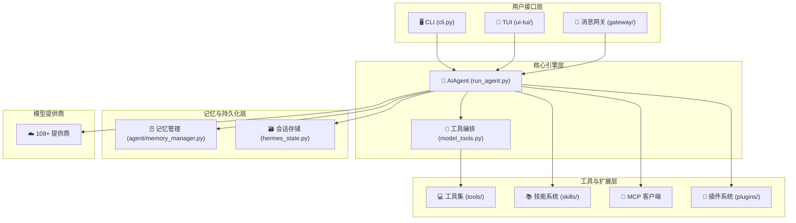

# 第 00 章：Hermes Agent 是什么

> 相关源码：`run_agent.py`、`hermes_cli/main.py`、`README.md`

---

## Hermes Agent 简介

Hermes Agent 是由 [Nous Research](https://nousresearch.com/) 开发的**自我改进型 AI 智能体（Self-Improving AI Agent）**。它不只是一个聊天机器人——它能够调用真实的工具（搜索网页、执行代码、操作文件系统），从每次交互中学习，并随着使用不断变得更聪明。

用一句话概括：**Hermes Agent 是一个可以在你的终端里工作、连接你的消息应用、处理真实任务的 AI 助手**。

---

## 核心特性

### 1. 自我改进（Self-Improving）

Hermes 最独特的地方在于它会**自动学习**：

- 每完成一个复杂任务后，Agent 会将解决方案提炼为**技能文件（Skill）**保存在 `~/.hermes/skills/` 中
- 下次遇到类似问题时，直接调用已有技能，无需重新摸索
- 同时维护 `~/.hermes/memories/MEMORY.md` 和 `USER.md`，记录关于世界和用户的重要知识

### 2. 多平台接入（Multi-Platform）

不只是命令行——Hermes 可以作为多种消息平台的助手运行：

- **即时通讯**：Telegram、Discord、Slack、Signal、Matrix、Mattermost
- **中国平台**：微信（WeChat）、企业微信（WeCom）、钉钉（DingTalk）、飞书（Feishu）、QQ 机器人
- **其他**：Email、SMS、WhatsApp、Webhook、API Server

### 3. 多模型支持（Multi-Model）

支持 **109+ 模型提供商**，包括：
- OpenRouter（200+ 模型的聚合器）
- OpenAI（GPT 系列）
- Anthropic（Claude 系列）
- Google Gemini
- Ollama（本地模型）
- 华为、阿里 Qwen、MiniMax、Kimi 等国内提供商

### 4. 真实工具调用（Real Tool Use）

Hermes 不只是生成文字——它可以：
- 在终端执行 Shell 命令
- 搜索和浏览网页
- 读写文件
- 运行 Python 代码
- 控制浏览器（Playwright 自动化）
- 调用 MCP（Model Context Protocol）服务器
- 与 Home Assistant 交互

---

## 与同类产品对比

| 特性 | Hermes Agent | ChatGPT | Claude Code | 传统聊天机器人 |
|------|-------------|---------|-------------|--------------|
| 本地运行 | ✅ | ❌ | ✅（VSCode 插件） | ❌ |
| 真实终端执行 | ✅ | ❌（有限） | ✅ | ❌ |
| 自我改进技能 | ✅ | ❌ | ❌ | ❌ |
| 持久记忆 | ✅ | 有限 | ❌ | ❌ |
| 消息平台集成 | ✅（18+平台） | ❌ | ❌ | 因产品而异 |
| 多模型切换 | ✅（109+） | ❌ | ❌ | ❌ |
| MCP 支持 | ✅ | ❌ | ✅ | ❌ |
| 开源 | ✅ | ❌ | ❌ | 因产品而异 |
| 子智能体并行 | ✅ | ❌ | ❌ | ❌ |

### 与 OpenClaw 的关系

Hermes Agent **是 OpenClaw 的直接继承者**。如果你之前使用过 OpenClaw，可以通过以下命令迁移：

```bash
hermes claw migrate
```

---

## 系统架构概览



---

## 适合的使用场景

Hermes Agent **擅长**：

- ✅ **编程辅助**：代码审查、debug、重构、执行测试
- ✅ **运维自动化**：服务器管理、日志分析、自动部署
- ✅ **研究助手**：网络搜索、信息整合、报告生成
- ✅ **个人助理**：日程提醒、消息汇总、多平台统一入口
- ✅ **数据处理**：文件批处理、格式转换、数据分析

Hermes Agent **不擅长**：

- ❌ 实时语音通话（仅有文字和语音转文字）
- ❌ 需要持续 GUI 交互的任务（有限的浏览器自动化）
- ❌ 超出上下文窗口的超长文档（有压缩但有损）
- ❌ 需要 100% 准确性的医疗/法律判断（AI 仍有幻觉）

---

## Hermes 的"学习循环"

Hermes 的自我改进机制是其最核心的设计哲学：

```
用户提出任务
    ↓
Agent 调用工具解决问题
    ↓
任务完成后，Agent 自动提炼解决方案
    ↓
生成技能文件 (~/.hermes/skills/xxx.md)
    ↓
下次类似任务，直接复用技能
    ↓
技能在使用中持续改进
```

这意味着 Hermes 越用越好。第一次帮你配置 Nginx，下次你只需要说"配置 Nginx"，它就知道你的环境和偏好了。

---

## 快速体验

如果你想立刻感受 Hermes，最快的方式：

```bash
# 一键安装
curl -fsSL https://raw.githubusercontent.com/NousResearch/hermes-agent/main/scripts/install.sh | bash

# 启动
hermes

# 或者 TUI 模式（更美观的界面）
hermes --tui
```

详细安装步骤见 [第 01 章：安装指南](01-installation.md)。

---

## 本章小结

- Hermes Agent 是 Nous Research 开发的**自我改进型 AI 智能体**
- 核心优势：真实工具调用 + 自我学习技能 + 持久记忆 + 多平台多模型
- 是 OpenClaw 的直接继承者，可通过 `hermes claw migrate` 迁移
- 架构上分为：用户接口层 → 核心引擎层 → 工具/技能/记忆层 → 模型提供商
- 下一章将介绍具体安装方法
