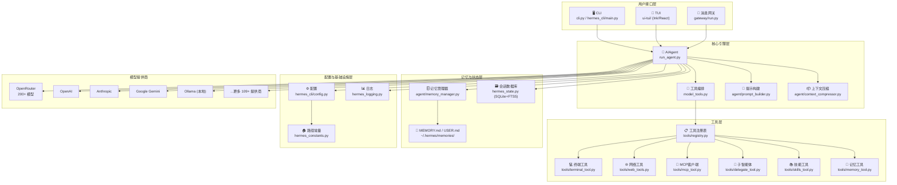

# 第 03 章：核心架构

> 相关源码：`run_agent.py`、`cli.py`、`hermes_cli/main.py`、`model_tools.py`、`toolsets.py`、`hermes_constants.py`、`hermes_logging.py`

---

## 整体架构图



---

## 各层职责说明

### 用户接口层

| 组件 | 文件 | 职责 |
|------|------|------|
| CLI | `cli.py` + `hermes_cli/main.py` | 交互式命令行，处理用户输入和斜杠命令 |
| TUI | `ui-tui/` (Ink/React) | 美化终端界面，通过 JSON-RPC 与 Python 后端通信 |
| 消息网关 | `gateway/run.py` | 连接 Telegram/Discord 等平台，将消息路由给 AIAgent |

CLI 是核心——TUI 和网关本质上都是不同的"皮肤"，底层都调用同一个 `AIAgent`。

### 核心引擎层

**`AIAgent`（`run_agent.py`）** 是整个系统的心脏：
- 维护对话历史（OpenAI 消息格式）
- 调用模型 API
- 管理工具调用循环
- 追踪迭代预算（默认最多 90 轮工具调用）
- 支持中断（`_interrupt_requested` 标志）

**`model_tools.py`** 负责工具编排：
- `discover_builtin_tools()` — 自动发现 `tools/*.py` 中的工具
- `handle_function_call()` — 分发工具调用到对应处理器
- 调用前/后触发插件钩子（`pre_tool_call`、`post_tool_call`）

### 工具层

所有工具都通过 **`tools/registry.py`** 的中央注册表管理：

```python
# tools/registry.py 中的核心数据结构
@dataclass
class ToolEntry:
    name: str          # 工具名
    toolset: str       # 所属工具集
    schema: dict       # JSON Schema（传给模型）
    handler: callable  # 实际执行函数
    check_fn: callable # 可用性检查（可选）
    requires_env: list # 需要的环境变量（可选）
```

工具发现是**自动的**——任何 `tools/*.py` 文件中有 `registry.register()` 调用，都会在导入时自动注册。

### 记忆与状态层

- **`agent/memory_manager.py`**：管理多个记忆提供商（内置 + 插件）
- **`~/.hermes/memories/`**：MEMORY.md（通用知识）和 USER.md（用户信息）
- **`hermes_state.py`**：SQLite + FTS5 全文搜索索引，存储所有会话

### 配置与基础设施层

| 文件 | 职责 |
|------|------|
| `hermes_cli/config.py` | `DEFAULT_CONFIG`、`load_config()`、深度合并用户配置 |
| `hermes_logging.py` | `setup_logging()`，配置 agent.log / errors.log / gateway.log |
| `hermes_constants.py` | `get_hermes_home()`、`display_hermes_home()`，配置文件感知路径 |

---

## 文件依赖链

理解代码时，这个依赖链非常重要：

```
tools/registry.py   ← 无依赖，最底层
       ↑
tools/*.py          ← 各调用 registry.register()
       ↑
model_tools.py      ← 导入 tools/registry，触发工具发现
       ↑
run_agent.py        ← 导入 model_tools，驱动整个 Agent 循环
cli.py              ←┘
batch_runner.py     ←┘
```

> ⚠️ 注意：`discover_plugins()` 只在导入 `model_tools.py` 时作为副作用执行。如果某些代码路径在没有导入 `model_tools` 的情况下读取插件状态，必须显式调用 `discover_plugins()`（它是幂等的）。

---

## 数据目录结构

```
~/.hermes/                     # 由 get_hermes_home() 返回
├── config.yaml                # 主配置（非敏感设置）
├── .env                       # API 密钥（chmod 600）
├── SOUL.md                    # Agent 人格/系统指令（可选）
├── memories/
│   ├── MEMORY.md              # 通用知识
│   └── USER.md                # 用户个人信息
├── skills/                    # 用户技能（自动生成 + 手动）
├── logs/
│   ├── agent.log              # 主日志（INFO+）
│   ├── errors.log             # 错误日志（WARNING+）
│   └── gateway.log            # 网关日志
├── sessions/                  # SQLite 会话数据库
│   └── sessions.db
├── plugins/                   # 用户安装的插件
└── profiles/                  # 多配置文件（hermes -p name）
    ├── work/
    │   ├── config.yaml
    │   └── .env
    └── personal/
        ├── config.yaml
        └── .env
```

> 💡 所有代码中访问 Hermes 数据目录都通过 `get_hermes_home()`，而不是硬编码 `~/.hermes`。这保证了多配置文件（Profile）隔离的正确性。

---

## 日志系统

日志由 `hermes_logging.py` 中的 `setup_logging()` 初始化，支持配置文件感知路径：

```python
# hermes_logging.py 关键函数
def setup_logging(hermes_home: Path = None):
    """配置 agent.log / errors.log / gateway.log"""
```

日志级别：
- `agent.log`：INFO 及以上（正常运行信息）
- `errors.log`：WARNING 及以上（错误和警告）

使用 CLI 查看日志：

```bash
hermes logs           # 查看最近日志
hermes logs --follow  # 实时跟踪
hermes logs --level error  # 只看错误
hermes logs --session abc123  # 查看特定会话
```

---

## TUI 进程模型

TUI 是一个独立的 Node.js 进程（Ink/React），通过标准输入输出（stdio）的 JSON-RPC 与 Python 后端通信：

```
hermes --tui
  └─ Node (Ink)  ──stdio JSON-RPC──  Python (tui_gateway)
       │                                  └─ AIAgent + tools + sessions
       └─ 渲染：对话记录、输入框、活动指示器
```

Python 负责业务逻辑，TypeScript 负责界面渲染。两者解耦，可以独立演进。

---

## 本章小结

- Hermes 架构分为 5 层：用户接口 → 核心引擎 → 工具 → 记忆/状态 → 配置/基础设施
- `AIAgent`（`run_agent.py`）是核心，CLI/TUI/网关都是它的前端
- 工具通过 `tools/registry.py` 统一注册和发现，自动感知
- 数据目录 `~/.hermes/` 通过 `get_hermes_home()` 访问，支持多配置文件隔离
- 日志分为三个文件：agent.log / errors.log / gateway.log
- TUI 是独立 Node.js 进程，通过 JSON-RPC 与 Python 通信
