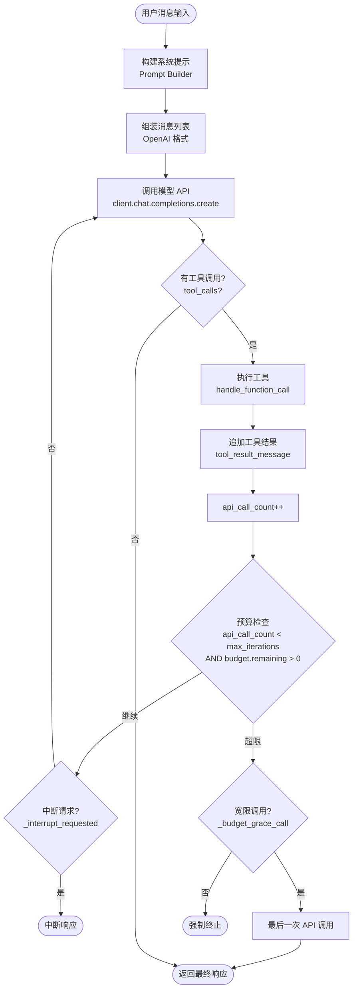

# 第 04 章：Agent 循环深度解析

> 相关源码：`run_agent.py`、`model_tools.py`、`agent/retry_utils.py`、`agent/error_classifier.py`

---

## 什么是 Agent 循环

传统 LLM 调用是"一问一答"——用户问，模型答，结束。

Agent 循环（Agent Loop）则是一个**持续的推理-行动周期**：

```
用户请求 → 模型推理 → 决定调用工具 → 执行工具 → 将结果反馈给模型 → 再次推理 → ...
```

直到模型认为任务完成，或达到迭代上限为止。这就是 Hermes 能完成复杂任务的根本原因。

---

## 核心循环流程图



---

## run_conversation() 源码解析

`run_agent.py` 中的 `run_conversation()` 方法包含主循环。以下是简化版的核心逻辑（约 12k 行的精华）：

```python
# run_agent.py（简化展示核心逻辑）
def run_conversation(self, user_message, system_message=None,
                     conversation_history=None, task_id=None):
    
    # 1. 构建初始消息列表
    messages = self._build_initial_messages(user_message, system_message)
    
    api_call_count = 0
    
    # 2. 主循环
    while (api_call_count < self.max_iterations 
           and self.iteration_budget.remaining > 0) \
          or self._budget_grace_call:
        
        # 检查中断请求
        if self._interrupt_requested:
            break
        
        # 3. 调用模型 API
        response = client.chat.completions.create(
            model=model,
            messages=messages,
            tools=tool_schemas
        )
        
        # 4. 检查是否有工具调用
        if response.tool_calls:
            for tool_call in response.tool_calls:
                # 5. 执行工具
                result = handle_function_call(
                    tool_call.name,
                    tool_call.args,
                    task_id
                )
                # 6. 将结果追加到消息列表
                messages.append(tool_result_message(result))
            
            api_call_count += 1
        else:
            # 7. 没有工具调用 = 最终响应
            return {
                "final_response": response.content,
                "messages": messages
            }
    
    # 8. 超出预算，触发宽限调用
    ...
```

**消息格式**遵循 OpenAI 标准：

```python
# 用户消息
{"role": "user", "content": "帮我分析这段代码"}

# 助手消息（带工具调用）
{"role": "assistant", "content": None, "tool_calls": [
    {"id": "call_abc", "function": {"name": "terminal", "arguments": '{"command": "ls -la"}'}}
]}

# 工具结果消息
{"role": "tool", "tool_call_id": "call_abc", "content": '{"output": "total 48\\n..."}'}
```

---

## 迭代预算（Iteration Budget）

Hermes 有两个层面的迭代限制：

### max_iterations（最大工具调用次数）

```yaml
# ~/.hermes/config.yaml
agent:
  max_turns: 90  # 默认 90 次工具调用
```

这是整个会话中模型调用（含工具调用轮次）的上限。对应 `AIAgent.__init__` 的 `max_iterations` 参数。

### iteration_budget（细粒度预算）

除了总次数限制，Hermes 还有 `iteration_budget` 追踪器，用于子智能体（subagent）场景：主 Agent 和子 Agent 共享预算池，防止子 Agent 无限消耗资源。

### 宽限调用（Grace Call）

当预算耗尽时，Hermes 会触发**一次宽限调用**（`_budget_grace_call`）：

```python
# run_agent.py
self._budget_grace_call = True  # 激活宽限模式
# 此时循环条件中 `or self._budget_grace_call` 为 True
# 允许最后一次 API 调用来生成终止性回复
```

这确保 Agent 在停止前能给用户一个完整的总结，而不是突然中断。

---

## 工具执行：handle_function_call()

当模型决定调用工具时，`model_tools.py` 中的 `handle_function_call()` 负责分发：

```python
# model_tools.py（简化）
def handle_function_call(tool_name: str, tool_args: dict, task_id: str = None) -> str:
    
    # 1. 触发插件 pre_tool_call 钩子
    plugin_manager.emit("pre_tool_call", tool_name, tool_args)
    
    # 2. 从注册表获取工具
    entry = registry.get(tool_name)
    if entry is None:
        return json.dumps({"error": f"Unknown tool: {tool_name}"})
    
    # 3. 检查工具可用性
    if entry.check_fn and not entry.check_fn():
        return json.dumps({"error": "Tool not available"})
    
    # 4. 调用工具处理器
    result = entry.handler(tool_args, task_id=task_id)
    
    # 5. 触发插件 post_tool_call 钩子
    plugin_manager.emit("post_tool_call", tool_name, tool_args, result)
    
    return result  # 必须是 JSON 字符串
```

所有工具处理器**必须返回 JSON 字符串**，这是不变的约定。

---

## 系统提示构建

每次 API 调用前，`agent/prompt_builder.py` 负责构建系统提示，包含：

1. **基础人格**（从配置或 `~/.hermes/SOUL.md`）
2. **技能指令**（活跃技能的内容）
3. **记忆上下文**（`<memory-context>` 块）
4. **工具说明**（当前可用工具列表）
5. **项目上下文**（AGENTS.md、HERMES.md 等本地文件）

> ⚠️ **重要**：系统提示一旦建立，在会话中不会随意修改，因为修改会破坏**提示缓存（Prompt Cache）**，导致 Token 成本急剧上升。技能、工具、记忆等需要中途变更时，默认是**延迟生效**（下次会话），除非明确使用 `--now` 标志。

---

## 中断机制

Hermes 支持优雅中断：

```python
# run_agent.py
class AIAgent:
    def request_interrupt(self):
        """外部调用此方法请求中断"""
        self._interrupt_requested = True
```

循环在**每次迭代开始前**检查 `_interrupt_requested` 标志。这意味着：
- 正在执行的工具调用会完成（不会强制杀死进程）
- 然后循环退出，返回到目前为止的结果

---

## 错误处理与重试

`agent/retry_utils.py` 和 `agent/error_classifier.py` 处理 API 调用错误：

```yaml
# ~/.hermes/config.yaml
agent:
  api_max_retries: 3  # 最大重试次数
```

错误分类器（`error_classifier.py`）区分：
- **可重试错误**：速率限制（429）、临时服务不可用（503）
- **不可重试错误**：认证失败（401）、无效请求（400）

对于可重试错误，使用**指数退避**策略自动重试。

---

## 工具强制策略

`agent.tool_use_enforcement` 配置控制工具调用行为：

```yaml
# ~/.hermes/config.yaml
agent:
  tool_use_enforcement: "auto"  # auto | required | none
```

- `auto`：模型自行决定是否调用工具（默认，推荐）
- `required`：强制每次都调用工具
- `none`：禁用工具调用

---

## 推理内容（Reasoning Content）

对于支持推理的模型（如 o1、claude-3.7-sonnet），模型的"思考过程"存储在：

```python
# run_agent.py 中的消息格式扩展
assistant_msg = {
    "role": "assistant",
    "content": "最终回答",
    "reasoning": "模型的推理过程..."  # 扩展字段
}
```

---

## 本章小结

- Agent 循环 = 持续的「推理 → 工具调用 → 结果反馈 → 再推理」周期
- 默认最多 90 次迭代（`agent.max_turns`），可配置
- 宽限调用（Grace Call）确保预算耗尽时还能生成终止性总结
- `handle_function_call()` 在 `model_tools.py` 中负责工具分发，调用前后触发插件钩子
- 中断是**优雅的**——等当前工具完成后再停止
- 系统提示一旦建立不轻易改变，保护提示缓存
- 错误重试：可重试错误自动指数退避重试，最多 3 次
