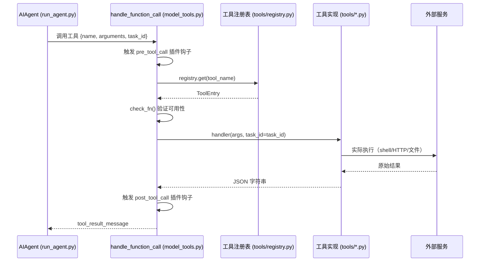

# 第 07 章：工具系统

> 相关源码：`tools/registry.py`、`model_tools.py`、`toolsets.py`、`tools/terminal_tool.py`、`tools/web_tools.py`

---

## 工具系统概览

Hermes 的工具系统（Tool System）是它能够执行真实任务的基础。工具不是"聊天功能"，而是真正的函数调用：执行 Shell 命令、搜索网页、读写文件、控制浏览器……

**关键设计原则**：
- 所有工具通过**中央注册表**（`tools/registry.py`）统一管理
- 工具文件**自动发现**——无需维护手动导入列表
- 所有工具处理器**必须返回 JSON 字符串**
- 工具分组到**工具集（Toolset）**，可按需启用/禁用

---

## 核心工具列表（_HERMES_CORE_TOOLS）

来自 `toolsets.py` 的核心工具集，默认全部启用：

| 工具名 | 功能 |
|--------|------|
| `web_search` | 网络搜索 |
| `web_extract` | 网页内容提取 |
| `terminal` | 执行 Shell 命令 |
| `process` | 进程管理 |
| `read_file` | 读取文件 |
| `write_file` | 写入文件 |
| `patch` | 文件补丁（增量编辑） |
| `search_files` | 文件内容搜索 |
| `vision_analyze` | 图像分析 |
| `image_generate` | 图像生成 |
| `skills_list` | 列出可用技能 |
| `skill_view` | 查看技能内容 |
| `skill_manage` | 管理技能（创建/更新/删除） |
| `browser_navigate` | 浏览器导航 |
| `browser_snapshot` | 页面快照（可访问性树） |
| `browser_click` | 浏览器点击 |
| `browser_type` | 浏览器输入文字 |
| `browser_scroll` | 浏览器滚动 |
| `browser_back` | 浏览器后退 |
| `browser_press` | 浏览器按键 |
| `browser_get_images` | 获取页面图片 |
| `browser_vision` | 浏览器视觉分析 |
| `browser_console` | 浏览器控制台 |
| `browser_cdp` | Chrome DevTools Protocol |
| `browser_dialog` | 浏览器对话框处理 |
| `text_to_speech` | 文字转语音 |
| `todo` | 待办任务管理 |
| `memory` | 记忆读写 |
| `session_search` | 历史会话搜索 |
| `clarify` | 向用户请求澄清 |
| `execute_code` | 执行 Python 代码 |
| `delegate_task` | 委派给子智能体 |
| `cronjob` | 定时任务管理 |
| `send_message` | 发送消息（网关模式） |
| `ha_list_entities` | Home Assistant 实体列表 |
| `ha_get_state` | Home Assistant 状态获取 |
| `ha_list_services` | Home Assistant 服务列表 |
| `ha_call_service` | Home Assistant 服务调用 |

---

## 工具注册表（registry.py）

```python
# tools/registry.py 核心数据结构
from dataclasses import dataclass
from typing import Callable, Optional, List

@dataclass
class ToolEntry:
    name: str                          # 工具唯一名称
    toolset: str                       # 所属工具集
    schema: dict                       # JSON Schema（传给模型）
    handler: Callable                  # 工具执行函数
    check_fn: Optional[Callable] = None   # 可用性检查（返回 bool）
    requires_env: Optional[List[str]] = None  # 需要的环境变量
```

注册工具：

```python
registry.register(
    name="my_tool",
    toolset="my_toolset",
    schema={...},
    handler=lambda args, **kw: my_function(args),
    check_fn=lambda: os.getenv("MY_API_KEY") is not None,
    requires_env=["MY_API_KEY"],
)
```

---

## 工具自动发现

工具文件**无需手动导入**——`model_tools.py` 中的 `discover_builtin_tools()` 会扫描 `tools/` 目录：

```python
# model_tools.py
def discover_builtin_tools():
    """自动发现并导入 tools/*.py 中的所有工具"""
    tools_dir = Path(__file__).parent / "tools"
    for tool_file in tools_dir.glob("*.py"):
        if tool_file.name.startswith("_"):
            continue
        import_module(f"tools.{tool_file.stem}")
        # 导入时，tools/*.py 中的顶层 registry.register() 调用自动执行
```

---

## 工具调用流程



---

## 工具集（Toolset）系统

工具集在 `toolsets.py` 中定义，控制哪些工具对 Agent 可见：

```python
# toolsets.py（简化）
_HERMES_CORE_TOOLS = [
    "web_search", "web_extract", "terminal", "read_file",
    "write_file", "browser_navigate", ...
]

TOOLSETS = {
    "hermes-cli": _HERMES_CORE_TOOLS,
    "code-execution": ["execute_code"],
    "home-assistant": ["ha_list_entities", "ha_get_state", ...],
    # ...
}
```

在配置中启用/禁用工具集：

```yaml
# ~/.hermes/config.yaml
toolsets:
  - hermes-cli       # 核心工具
  - code-execution   # 额外启用代码执行
```

---

## 添加自定义工具（2 步操作）

只需修改 2 个文件：

### 步骤 1：创建 `tools/my_tool.py`

```python
# tools/my_tool.py
import json
import os
from tools.registry import registry

def check_requirements() -> bool:
    """检查工具是否可用"""
    return bool(os.getenv("MY_SERVICE_API_KEY"))

def translate_text(text: str, target_lang: str = "zh", task_id: str = None) -> str:
    """实际工具逻辑"""
    api_key = os.getenv("MY_SERVICE_API_KEY")
    # ... 实际翻译逻辑 ...
    return json.dumps({
        "success": True,
        "translated": f"[翻译结果: {text}]",
        "target_language": target_lang
    })

registry.register(
    name="translate_text",
    toolset="my_custom",
    schema={
        "name": "translate_text",
        "description": "翻译文本到指定语言",
        "parameters": {
            "type": "object",
            "properties": {
                "text": {
                    "type": "string",
                    "description": "要翻译的文本"
                },
                "target_lang": {
                    "type": "string",
                    "description": "目标语言代码（如 zh、en、ja）",
                    "default": "zh"
                }
            },
            "required": ["text"]
        }
    },
    handler=lambda args, **kw: translate_text(
        text=args.get("text", ""),
        target_lang=args.get("target_lang", "zh"),
        task_id=kw.get("task_id")
    ),
    check_fn=check_requirements,
    requires_env=["MY_SERVICE_API_KEY"],
)
```

### 步骤 2：添加到 `toolsets.py`

```python
# toolsets.py
TOOLSETS = {
    "hermes-cli": _HERMES_CORE_TOOLS,
    "my_custom": ["translate_text"],  # 新增工具集
    # ...
}
```

然后在配置中启用：

```yaml
toolsets:
  - hermes-cli
  - my_custom
```

---

## 终端工具深度解析（terminal_tool.py）

终端工具（`terminal`）是 Hermes 中最强大也最复杂的工具之一：

```python
# tools/terminal_tool.py 支持的后端
BACKENDS = {
    "local": LocalTerminalBackend,      # 本地 Shell
    "docker": DockerTerminalBackend,    # Docker 容器
    "ssh": SSHTerminalBackend,          # 远程 SSH
    "modal": ModalTerminalBackend,      # Modal 云
    "singularity": SingularityBackend,  # Singularity 容器
    "daytona": DaytonaBackend,          # Daytona 工作区
}
```

配置后端：

```yaml
# ~/.hermes/config.yaml
terminal:
  backend: "docker"   # 用 Docker 沙箱提高安全性
  timeout: 180        # 超时秒数
```

---

## 工具可用性检查

工具通过 `check_fn` 在注册时声明依赖：

```python
# 示例：只有安装了 Playwright 才启用浏览器工具
registry.register(
    name="browser_navigate",
    check_fn=lambda: shutil.which("playwright") is not None,
    requires_env=[],
    ...
)
```

`hermes doctor` 命令会运行所有工具的 `check_fn` 并报告状态：

```bash
hermes doctor
# ✅ terminal - 可用
# ✅ web_search - 可用
# ⚠️  browser_navigate - 需要 playwright install
# ❌ ha_list_entities - 需要 HOME_ASSISTANT_URL
```

---

## 本章小结

- 工具是 Hermes 的"手脚"——通过真实函数调用完成任务
- 核心工具集（`_HERMES_CORE_TOOLS`）包含 40+ 工具，涵盖终端、网络、文件、浏览器等
- 工具通过 `tools/registry.py` 注册，`discover_builtin_tools()` 自动发现
- **所有工具处理器必须返回 JSON 字符串**
- 添加自定义工具只需 2 步：创建 `tools/my_tool.py` + 在 `toolsets.py` 中注册
- 工具集系统允许按需启用/禁用工具组
- `hermes doctor` 检查工具可用性
