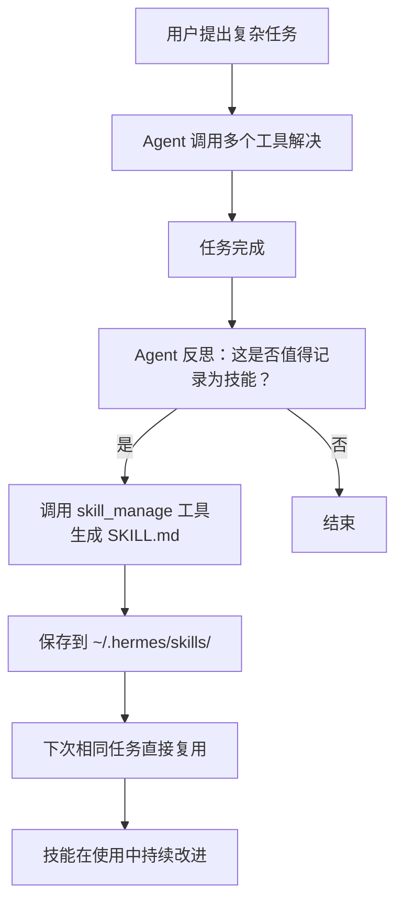

# 第 08 章：技能系统

> 相关源码：`tools/skills_tool.py`、`tools/skills_hub.py`、`agent/skill_commands.py`、`skills/`、`optional-skills/`

---

## 技能 vs 工具

理解 Hermes 中"技能（Skill）"和"工具（Tool）"的区别至关重要：

| 维度 | 工具（Tool） | 技能（Skill） |
|------|------------|-------------|
| 本质 | Python 函数 | Markdown 指令文件 |
| 执行方式 | 直接调用代码 | 注入为用户消息，引导 Agent 行为 |
| 扩展方式 | 写 Python 代码 | 写 Markdown 文件 |
| 存储位置 | `tools/*.py` | `~/.hermes/skills/`、`skills/`、`optional-skills/` |
| 学习能力 | 固定逻辑 | Agent 可以自动生成和改进 |
| 示例 | `terminal`、`web_search` | `github/code-review`、`devops/deploy` |

**类比**：工具是锤子、扳手（固定功能的实物工具），技能是操作手册（告诉你如何使用工具解决特定问题）。

---

## SKILL.md 文件格式

技能是带有 YAML 前置元数据的 Markdown 文件：

```markdown
---
name: docker-deploy
description: 将 Docker 应用部署到生产服务器
version: 1.2.0
platforms:
  - linux
  - macos
metadata:
  hermes:
    tags:
      - devops
      - docker
      - deployment
    category: devops
    config:
      DEPLOY_SERVER: "部署服务器地址（IP 或域名）"
      DEPLOY_USER: "SSH 用户名"
---

# Docker 应用部署技能

当用户要求部署 Docker 应用时，按照以下步骤操作：

## 部署流程

1. 首先检查本地 Docker 镜像是否构建完成：
   ```
   docker images | grep <app-name>
   ```

2. 将镜像推送到 Registry：
   ```
   docker push <registry>/<app-name>:<tag>
   ```

3. SSH 连接到部署服务器（使用 $DEPLOY_USER@$DEPLOY_SERVER）

4. 在服务器上拉取最新镜像并重启服务：
   ```
   docker pull <registry>/<app-name>:<tag>
   docker-compose up -d --no-deps <app-name>
   ```

5. 验证部署成功：
   ```
   docker ps | grep <app-name>
   curl http://localhost:<port>/health
   ```

## 注意事项
- 部署前先备份当前版本
- 检查服务日志确认无错误：`docker logs <container-name>`
```

### 前置元数据字段说明

| 字段 | 说明 |
|------|------|
| `name` | 技能唯一标识符，也是激活的斜杠命令名 |
| `description` | 技能描述 |
| `version` | 版本号 |
| `platforms` | 操作系统限制（`linux`、`macos`、`windows`） |
| `metadata.hermes.tags` | 搜索标签 |
| `metadata.hermes.category` | 分类（用于技能浏览器） |
| `metadata.hermes.config` | 技能需要的配置项（在 `skills.config.<key>` 下存储） |

---

## 技能激活方式

### 斜杠命令激活

```
/docker-deploy
```

### 对话触发（隐式激活）

如果技能描述匹配用户请求，Agent 也会自动加载相关技能：

```
你：帮我把这个 Flask 应用部署到 Docker
Agent：（自动加载 docker-deploy 技能后）好的，按照以下步骤...
```

### 技能注入机制

**重要**：技能内容注入为**用户消息**，而不是系统提示。这是刻意的设计：

```python
# agent/skill_commands.py
# 技能注入为用户消息，而非系统提示
# 原因：保护提示缓存（Prompt Cache）
# 如果注入到系统提示，每次加载技能都会破坏缓存
messages.append({
    "role": "user",
    "content": f"[技能指令]\n{skill_content}"
})
```

---

## 技能目录结构

```
技能来源优先级（从高到低）：
~/.hermes/skills/     ← 用户技能（用户创建 + Agent 自动生成）
skills/               ← 内置技能（随仓库发布）
optional-skills/      ← 可选技能（需要显式安装）
```

内置技能分类（`skills/` 目录）：

```
skills/
├── github/           # GitHub 工作流（代码审查、PR 管理等）
├── devops/           # 运维（部署、监控、容器管理）
├── productivity/     # 生产力（日程、笔记、任务管理）
├── research/         # 研究（文献搜索、摘要等）
└── ...
```

可选技能分类（`optional-skills/` 目录，更重量级）：

```
optional-skills/
├── autonomous-ai-agents/  # 自主 AI 代理
├── blockchain/            # 区块链操作
├── communication/         # 通信集成
├── creative/              # 创意写作
├── devops/                # 高级 DevOps
├── email/                 # 邮件管理
├── health/                # 健康追踪
├── mcp/                   # MCP 服务器集成
├── migration/             # 数据迁移
├── mlops/                 # ML 运维
├── productivity/          # 高级生产力工具
├── research/              # 深度研究
├── security/              # 安全审计
└── web-development/       # Web 开发
```

---

## 技能管理命令

```bash
# 浏览可用技能
hermes skills browse

# 安装内置可选技能
hermes skills install official/devops/kubernetes

# 从 Skills Hub 安装
hermes skills install agentskills-io/python-debugging

# 查看已安装技能
# 在对话中使用工具
你：列出所有可用技能
# Agent 调用 skills_list 工具

# 查看技能内容
你：查看 docker-deploy 技能的内容
# Agent 调用 skill_view 工具

# 创建新技能
hermes skills create my-skill

# 在对话中管理技能
你：创建一个技能，记录如何设置我的 Python 开发环境
# Agent 使用 skill_manage 工具创建技能
```

---

## 技能自动生成（学习循环）

Hermes 最重要的特性之一：**完成复杂任务后，Agent 会自动将解决方案提炼为技能**。

工作流程：



示例：
1. 你第一次请求 Hermes 帮你配置 Nginx 反向代理
2. Agent 执行了 10 个工具调用，搞定了 Nginx 配置
3. 任务完成后，Agent 自动创建 `~/.hermes/skills/nginx-reverse-proxy.md`
4. 下次你说"配置 Nginx"，Agent 直接加载技能，3 个工具调用搞定

---

## Skills Hub（agentskills.io）

Hermes 与 [agentskills.io](https://agentskills.io) 开放标准兼容，可以从社区技能库安装技能：

```bash
# 安装社区技能
hermes skills install agentskills-io/<skill-name>

# 发布你的技能到 Skills Hub
hermes skills publish my-skill
```

Skills Hub 遵循 `agentskills.io` 开放标准，与其他兼容 Agent 框架的技能也可以互用。

---

## 技能配置（skills.config）

技能可以声明需要的配置项（在 `metadata.hermes.config` 中）。这些配置保存在 `config.yaml` 的 `skills.config` 下：

```yaml
# ~/.hermes/config.yaml
skills:
  config:
    DEPLOY_SERVER: "192.168.1.100"
    DEPLOY_USER: "ubuntu"
```

在技能内容中通过 `$CONFIG_KEY` 引用这些配置。

---

## 本章小结

- **技能是 Markdown 文件，工具是 Python 函数**——技能引导 Agent 行为，工具执行实际操作
- 技能通过斜杠命令（`/skill-name`）激活，注入为**用户消息**（保护提示缓存）
- 技能目录优先级：`~/.hermes/skills/` > `skills/`（内置）> `optional-skills/`（需安装）
- 技能**自动生成**是核心自我改进机制——复杂任务完成后 Agent 自动提炼技能
- `hermes skills browse` 和 `hermes skills install` 管理技能
- 兼容 agentskills.io 开放标准，可与社区技能库互通
