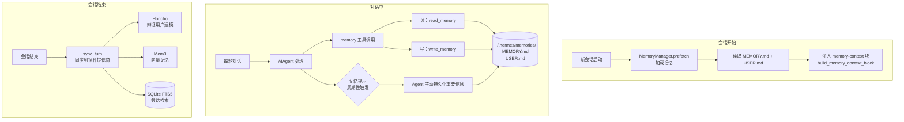

# 第 09 章：记忆系统

> 相关源码：`agent/memory_manager.py`、`tools/memory_tool.py`、`hermes_state.py`、`plugins/memory/`

---

## 为什么需要记忆系统

大多数 AI 工具有个根本缺陷：**每次对话都从零开始**。它不记得你上周教过它什么，不记得你的服务器 IP，不记得你偏好的代码风格。

Hermes 的记忆系统解决这个问题：通过多层记忆机制，让 Agent 能够跨会话积累知识和用户偏好，越用越懂你。

---

## 记忆系统架构



---

## 内置记忆提供商（BuiltinMemoryProvider）

内置提供商**始终处于活跃状态**，基于两个 Markdown 文件：

### MEMORY.md（通用知识）

```markdown
# ~/.hermes/memories/MEMORY.md

存储 Agent 学到的关于世界和任务的通用知识：
- 服务器架构信息
- 项目结构描述
- 常用命令和配置
- 解决过的技术问题
```

示例内容：
```markdown
## 技术知识
- 用户的主要服务器是 Ubuntu 22.04，IP: 10.0.1.5
- 项目使用 PostgreSQL 15，数据库名 app_db
- 部署脚本在 /opt/deploy/deploy.sh
- Nginx 配置在 /etc/nginx/sites-enabled/app

## 偏好
- 代码风格：PEP 8，行宽 88（Black 格式）
- 提交信息：遵循 Conventional Commits 规范
```

### USER.md（用户个人信息）

```markdown
# ~/.hermes/memories/USER.md

存储关于用户个人偏好和背景的信息：
- 职业背景和技术栈
- 工作习惯和偏好
- 常用工具和环境
```

示例内容：
```markdown
## 基本信息
- 用户是全栈工程师，主要使用 Python + React
- 使用 macOS M2，终端是 Zsh + Oh My Zsh
- 偏好简洁的中文回答，遇到技术问题才用英文

## 工作习惯
- 早上 9 点开始工作，通常通过 Telegram 联系
- 喜欢先看摘要，详细内容按需展开
```

---

## 记忆注入机制

每次会话开始时，记忆内容通过 `build_memory_context_block()` 包装后注入：

```python
# agent/memory_manager.py
def build_memory_context_block(memory_content: str) -> str:
    return f"""<memory-context>
{memory_content}
</memory-context>"""
```

这个 `<memory-context>` 块作为系统提示的一部分，让 Agent 在对话开始时就"记得"之前学到的信息。

---

## memory 工具

Agent 在对话中可以通过 `memory` 工具主动读写记忆（来自 `tools/memory_tool.py`）：

```
# Agent 在对话中的工具调用示例
{
  "tool": "memory",
  "action": "write",
  "content": "用户偏好：代码审查时重点关注安全性和性能",
  "memory_type": "USER"   // 写入 USER.md
}

{
  "tool": "memory",
  "action": "read",
  "memory_type": "MEMORY"  // 读取 MEMORY.md
}
```

---

## 记忆提示（Memory Nudges）

Hermes 会周期性地在系统提示中加入"记忆提示"，鼓励 Agent 主动持久化重要信息：

```
[系统提示中周期性加入]
如果本次对话中学到了关于用户或环境的重要信息，
请使用 memory 工具将其保存，以便下次使用。
```

这形成了自动的知识积累循环。

---

## 插件记忆提供商

内置提供商之外，Hermes 还支持多种插件记忆提供商（`plugins/memory/`）：

| 提供商 | 特点 | 配置 |
|--------|------|------|
| `builtin` | 默认，基于文件，简单可靠 | 无需配置 |
| `honcho` | 辩证用户建模，深度理解用户意图 | 需要 Honcho 服务 |
| `mem0` | 向量记忆，语义搜索 | 需要 Mem0 API Key |
| `supermemory` | 知识图谱，结构化记忆 | 需要 Supermemory API Key |
| `byterover` | 企业级记忆 | 需要 Byterover API Key |
| `hindsight` | 事后分析型记忆 | 需要配置 |
| `holographic` | 多维记忆压缩 | 需要配置 |
| `openviking` | 开放记忆协议 | 需要配置 |
| `retaindb` | 结构化记忆数据库 | 需要 RetainDB 配置 |

切换记忆提供商：

```yaml
# ~/.hermes/config.yaml
memory:
  provider: honcho  # 切换到 Honcho
```

---

## Honcho 记忆提供商（深度用户建模）

Honcho 是最先进的记忆提供商，它不只存储事实，而是建立**辩证（Dialectical）用户模型**：

```bash
# Honcho 专属命令
hermes honcho setup     # 配置 Honcho 连接
hermes honcho status    # 查看 Honcho 状态
hermes honcho sessions  # 查看 Honcho 管理的会话
hermes honcho map       # 查看用户模型地图
hermes honcho peer      # Peer 模式（高级）
hermes honcho mode      # 切换 Honcho 模式
hermes honcho tokens    # 查看 Token 使用
hermes honcho identity  # 身份管理
hermes honcho migrate   # 从内置迁移到 Honcho
```

---

## FTS5 会话搜索

`hermes_state.py` 使用 SQLite 的 FTS5 全文搜索扩展索引所有会话内容：

```bash
# CLI 浏览会话
hermes sessions browse

# 在对话中使用 session_search 工具
你：搜索我上周关于 Redis 配置的对话
# Agent 调用 session_search 工具，返回相关会话片段
```

FTS5 支持：
- 关键词搜索
- 短语搜索（"exact phrase"）
- 前缀搜索（word*）
- 布尔操作（AND、OR、NOT）

---

## 记忆管理命令

```bash
# 在交互界面中查看记忆
/memory

# 查看记忆文件内容
cat ~/.hermes/memories/MEMORY.md
cat ~/.hermes/memories/USER.md

# 手动编辑记忆（直接编辑文件）
nano ~/.hermes/memories/MEMORY.md

# 重置记忆（慎用！）
# 直接清空文件内容，或在 hermes 中：
# 你：请清空你的记忆文件
```

---

## 本章小结

- Hermes 记忆系统分两层：**会话内**（上下文）和**跨会话**（持久化文件）
- 内置提供商使用两个 Markdown 文件：`MEMORY.md`（通用知识）和 `USER.md`（用户信息）
- Agent 通过 `memory` 工具和"记忆提示"机制主动积累知识
- 支持 9 种记忆提供商，从简单文件到 Honcho 辩证用户建模
- FTS5 全文搜索让历史会话内容可以快速检索
- 记忆文件在 `~/.hermes/memories/`，可直接查看和编辑
