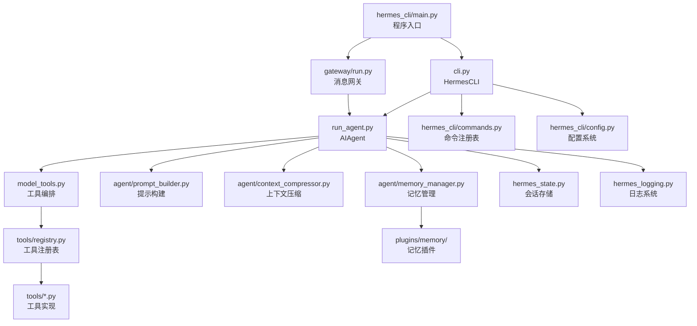

# 第 16 章：源码阅读指南

> 本章为希望深入理解 Hermes 内部实现、进行二次开发或贡献代码的读者准备。

---

## 从哪里开始

Hermes 代码库约 12+ 万行，直接阅读会迷失方向。推荐从**入口到核心**的路径：

```
hermes_cli/main.py    ← 程序入口，理解命令路由
       ↓
cli.py                ← 交互式聊天的核心控制器
       ↓
run_agent.py          ← AIAgent 类，最核心的文件
       ↓
model_tools.py        ← 工具编排，连接 Agent 与工具层
       ↓
tools/registry.py     ← 工具注册表，理解工具系统基础
```

---

## 推荐阅读顺序

### 第一轮：理解整体流程（半天）

1. **`hermes_cli/main.py`**（约 800 行）
   - 程序如何启动
   - 命令行参数解析（argparse）
   - 子命令路由（`setup`、`gateway`、`model` 等）
   - Profile 系统：`_apply_profile_override()`

2. **`hermes_cli/commands.py`**（约 300 行）
   - `COMMAND_REGISTRY` 列表 —— 所有斜杠命令的声明
   - `CommandDef` 数据类结构
   - 理解命令系统的数据驱动设计

3. **`hermes_cli/config.py`**（约 600 行）
   - `DEFAULT_CONFIG` —— 完整的默认配置树
   - `load_config()` —— 深度合并配置
   - `OPTIONAL_ENV_VARS` —— 所有 .env 变量的元数据

### 第二轮：理解 Agent 核心（一天）

4. **`run_agent.py`**（约 12,000 行）
   - `AIAgent.__init__()` —— 60+ 参数，理解各类配置
   - `run_conversation()` —— 核心循环（搜索这个函数名）
   - 消息格式：system/user/assistant/tool
   - 工具调用处理：`response.tool_calls`
   - 中断机制：`_interrupt_requested`、`request_interrupt()`
   - 预算追踪：`iteration_budget`、`_budget_grace_call`
   - 推理内容：`reasoning` 字段

5. **`model_tools.py`**（约 3,000 行）
   - `discover_builtin_tools()` —— 自动发现工具的实现
   - `handle_function_call()` —— 工具分发逻辑
   - 插件钩子触发：`pre_tool_call`、`post_tool_call`
   - `get_tool_definitions()` —— 动态生成工具 Schema

### 第三轮：理解工具层（半天）

6. **`tools/registry.py`**（约 200 行）
   - `ToolEntry` 数据类
   - `registry.register()` 方法
   - `registry.get()` 方法

7. **`tools/terminal_tool.py`**（约 1,000 行）
   - 最复杂的工具之一
   - 理解多后端（local/docker/ssh）的实现
   - 后台进程和通知机制

8. **`tools/delegate_tool.py`**（约 500 行）
   - `delegate_task` 工具实现
   - 线程池中的子 Agent
   - `_last_resolved_tool_names` 全局状态的保存/恢复

### 第四轮：理解记忆和上下文层（半天）

9. **`agent/memory_manager.py`**（约 800 行）
   - `MemoryManager` 类
   - `MemoryProvider` ABC
   - `build_memory_context_block()`
   - 记忆提示（nudge）机制

10. **`agent/context_compressor.py`**（约 600 行）
    - `ContextCompressor` 类
    - `should_compress()` 逻辑
    - `compress()` 实现：保留首尾、摘要中间

11. **`hermes_state.py`**（约 400 行）
    - `SessionDB` 类
    - SQLite + FTS5 全文搜索
    - 会话存储和检索

---

## 模块关系图



---

## 关键设计模式

### 1. 注册表模式（Registry Pattern）

工具系统和斜杠命令都用了注册表模式：

```python
# tools/registry.py
class ToolRegistry:
    _tools: Dict[str, ToolEntry] = {}
    
    def register(self, name, toolset, schema, handler, ...):
        self._tools[name] = ToolEntry(...)
    
    def get(self, name) -> Optional[ToolEntry]:
        return self._tools.get(name)

# 任何 tools/*.py 文件中的顶层调用
registry.register(name="my_tool", ...)  # 导入时自动执行
```

```python
# hermes_cli/commands.py
COMMAND_REGISTRY = [
    CommandDef("new", "开始新会话", "Session"),
    CommandDef("stop", "停止任务", "Session"),
    ...
]
```

### 2. 数据驱动设计

斜杠命令的完整系统（帮助文本、自动补全、Telegram 菜单、Slack 命令映射）都从同一个 `COMMAND_REGISTRY` 自动派生，无需在多处维护。

### 3. 依赖链设计

`tools/registry.py` 没有任何外部依赖（最底层），使得它可以被任何文件安全导入，而工具发现只在需要时（导入 `model_tools.py`）触发。

---

## 调试技巧

### 查看实时工具调用

```bash
# 开启详细日志
hermes logs --follow --level debug
```

### 查看 Token 消耗

```
/usage  # 在 Hermes 交互中查看
```

### 测试工具可用性

```bash
hermes doctor  # 检查所有工具的可用性
```

### 单步调试 Python（高级）

```python
# 在源码中加入断点
import pdb; pdb.set_trace()

# 或使用 ipdb
import ipdb; ipdb.set_trace()
```

---

## 运行测试

**永远使用 `scripts/run_tests.sh`，不要直接调用 pytest**：

```bash
# 全量测试
scripts/run_tests.sh

# 测试特定目录
scripts/run_tests.sh tests/agent/

# 测试特定文件
scripts/run_tests.sh tests/tools/test_terminal.py

# 传递 pytest 参数
scripts/run_tests.sh -v --tb=long
```

为什么不能直接用 pytest：
- 测试需要隔离 `HERMES_HOME`（conftest.py 的 autouse fixture 处理）
- CI 使用 4 个 xdist worker（避免并发测试问题）
- 需要清除 `*_API_KEY` 等环境变量

---

## 贡献代码的注意事项

1. **不要硬编码 `~/.hermes`**：用 `get_hermes_home()`
2. **工具必须返回 JSON 字符串**
3. **不要在工具 Schema 中交叉引用其他工具**：可能导致模型幻觉调用不存在的工具
4. **缓存感知**：技能/记忆/工具变更默认下次会话生效，保护提示缓存
5. **不要写变化检测测试**：不要断言特定模型名字、版本号、枚举数量

---

## 本章小结

- 推荐阅读顺序：`main.py` → `cli.py` → `run_agent.py` → `model_tools.py` → `tools/registry.py`
- Agent 核心在 `run_agent.py` 的 `run_conversation()`，12k 行但结构清晰
- 工具层基于注册表模式，自动发现，无需维护手动导入
- 斜杠命令基于数据驱动的 `COMMAND_REGISTRY`，一处定义全处生效
- 测试使用 `scripts/run_tests.sh`，永远不要直接调用 pytest
- 贡献代码时注意：路径用 `get_hermes_home()`、工具返回 JSON、缓存感知设计
