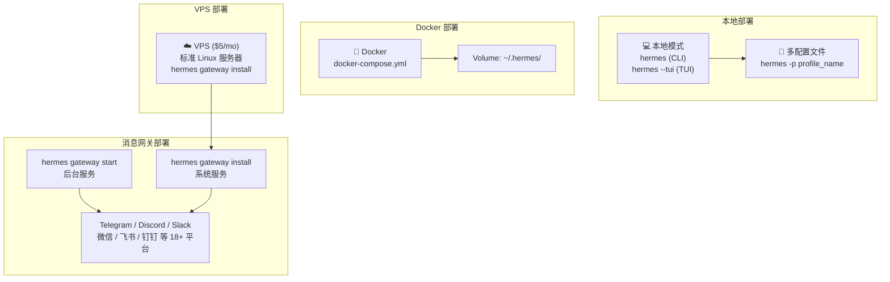

# 第 17 章：部署与运维

> 相关源码：`Dockerfile`、`docker-compose.yml`、`gateway/run.py`、`hermes_cli/main.py`

---

## 部署场景概览



---

## 本地部署

### 标准 CLI 模式

```bash
# 激活虚拟环境
source ~/.hermes/venv/bin/activate  # 或 source .venv/bin/activate

# 启动
hermes

# TUI 模式（需要 Node.js）
hermes --tui
```

### 多配置文件（Profile）

适合同时管理多个独立实例（工作/个人、多个机器人等）：

```bash
# 创建并使用工作配置文件
hermes -p work

# 创建并使用个人配置文件
hermes -p personal

# 列出所有配置文件
hermes profile list

# 每个配置文件有独立的数据目录
# ~/.hermes/profiles/work/config.yaml
# ~/.hermes/profiles/work/.env
# ~/.hermes/profiles/work/memories/
# ~/.hermes/profiles/personal/config.yaml
# ...
```

---

## 消息网关部署

### 直接后台运行

```bash
# 后台启动（需要手动保持进程活跃）
hermes gateway start

# 查看状态
hermes gateway status

# 查看日志
hermes logs --follow
tail -f ~/.hermes/logs/gateway.log
```

### 安装为系统服务（推荐）

```bash
# 安装为 systemd 服务（Linux）或 launchd（macOS）
hermes gateway install

# 启动服务
sudo systemctl start hermes-agent
# 或 macOS：
launchctl start com.hermes-agent

# 开机自启
sudo systemctl enable hermes-agent

# 查看服务状态
sudo systemctl status hermes-agent

# 卸载服务
hermes gateway uninstall
```

---

## Docker 部署

仓库根目录包含 `Dockerfile` 和 `docker-compose.yml`：

```yaml
# docker-compose.yml（示例）
version: '3.8'
services:
  hermes:
    build: .
    volumes:
      - ~/.hermes:/root/.hermes  # 挂载配置目录
    environment:
      - HERMES_HOME=/root/.hermes
    restart: unless-stopped
```

```bash
# 构建并启动
docker-compose up -d

# 查看日志
docker-compose logs -f

# 进入容器
docker-compose exec hermes bash

# 停止
docker-compose down
```

**Docker 的优势**：
- 环境隔离，不污染主机
- 统一的依赖管理
- 使用 Docker 作为终端后端时，提供沙箱执行环境（`terminal.backend: docker`）

---

## VPS 部署（推荐生产使用）

在一台 $5/月的 VPS 上运行 Hermes 作为 24/7 消息助手：

### 1. 准备服务器

```bash
# 连接到 VPS（Ubuntu 22.04）
ssh ubuntu@your-vps-ip

# 安装 Hermes
curl -fsSL https://raw.githubusercontent.com/NousResearch/hermes-agent/main/scripts/install.sh | bash
source ~/.bashrc
```

### 2. 配置

```bash
hermes setup          # 配置 API 密钥
hermes gateway setup  # 配置消息平台（Telegram 等）
```

### 3. 安装为服务

```bash
hermes gateway install    # 安装 systemd 服务
sudo systemctl enable hermes-agent
sudo systemctl start hermes-agent
sudo systemctl status hermes-agent
```

### 4. 验证

```bash
# 确认服务运行中
hermes gateway status

# 查看日志
hermes logs --follow
```

---

## NixOS 部署

```nix
# /etc/nixos/configuration.nix
{
  services.hermes-agent = {
    enable = true;
    # HERMES_MANAGED=nix 自动设置
  };
}
```

```bash
# 激活
sudo nixos-rebuild switch
```

---

## Homebrew 管理模式（macOS）

通过 Homebrew 安装时：

```bash
brew install hermes-agent
# HERMES_MANAGED=brew 自动设置
```

托管模式（`HERMES_MANAGED`）表示 Hermes 由包管理器管理，`hermes update` 命令会相应地调用 `brew upgrade` 或 `nixos-rebuild`。

---

## 日志管理

```bash
# 实时查看所有日志
hermes logs --follow

# 只看错误
hermes logs --level error

# 查看特定会话
hermes logs --session abc123

# 日志文件直接查看
ls -la ~/.hermes/logs/
tail -n 100 ~/.hermes/logs/agent.log
tail -n 100 ~/.hermes/logs/gateway.log
grep "ERROR" ~/.hermes/logs/errors.log
```

日志文件：
- `agent.log`：INFO 级别以上，正常运行信息
- `errors.log`：WARNING 级别以上，错误和警告
- `gateway.log`：消息网关专用日志

---

## 更新

```bash
# 更新 Hermes
hermes update

# 检查当前版本
hermes version
```

---

## 备份与迁移

`~/.hermes/` 目录包含所有需要备份的内容：

```bash
# 备份
tar -czf hermes-backup-$(date +%Y%m%d).tar.gz ~/.hermes/

# 重要内容：
# ~/.hermes/config.yaml     - 配置
# ~/.hermes/.env            - API 密钥
# ~/.hermes/memories/       - 记忆文件（重要！）
# ~/.hermes/skills/         - 用户技能（重要！）
# ~/.hermes/sessions/       - 会话历史
# ~/.hermes/SOUL.md         - 人格文件（如果有）
```

**迁移到新机器**：

```bash
# 在旧机器上
tar -czf hermes-backup.tar.gz ~/.hermes/

# 传输到新机器
scp hermes-backup.tar.gz newmachine:~/

# 在新机器上安装 Hermes
curl -fsSL https://raw.githubusercontent.com/NousResearch/hermes-agent/main/scripts/install.sh | bash

# 恢复数据
cd ~
tar -xzf hermes-backup.tar.gz
```

---

## 监控与健康检查

```bash
# 全面诊断
hermes doctor

# 检查 API 连通性
hermes doctor --check-api

# 查看 Token 使用统计（在 Hermes 交互中）
/usage
/insights
```

---

## 本章小结

- **本地**：`hermes`（CLI）或 `hermes --tui`，多配置文件用 `hermes -p <name>`
- **消息网关**：`hermes gateway install` + `systemctl enable` 实现开机自启
- **Docker**：`docker-compose up -d`，配置通过 volume 挂载
- **VPS**：$5/月服务器 + `hermes gateway install` 即可 24/7 运行
- **NixOS / Homebrew**：托管模式（`HERMES_MANAGED`）自动适配包管理器
- **备份**：备份整个 `~/.hermes/` 目录（config、.env、memories、skills 最重要）
- **迁移**：打包 `~/.hermes/`，新机器安装后解压还原
